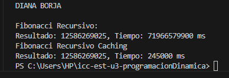

# Programación Dinámica

## 📌 Información General

- **Título:** Programación Dinámica
- **Asignatura:** Estructura de Datos
- **Carrera:** Computación
- **Estudiante:** Diana Borja
- **Fecha:** 16/07/2025
- **Profesor:** Ing. Pablo Torres

---

## 🛠️ Descripción

Este proyecto implementa diferentes métodos para calcular números de la serie de Fibonacci en Java, comparando eficiencia y rendimiento:

- Método recursivo simple (sin optimización).  
- Método con memoización (programación dinámica top-down).  
- Método iterativo (programación dinámica bottom-up).

El proyecto también permite comparar los tiempos de ejecución para cada método, mostrando la ventaja de usar programación dinámica.

---

## 🚀 Ejecución

Para compilar y ejecutar el proyecto sigue estos pasos:

1. Compila el código:  
    ```bash
    javac App.java EjerciciosPD.java
    ```

2. Ejecuta la aplicación:  
    ```bash
    java App
    ```

---

---
## RESULTADOS OBTENIDOS CON 50



